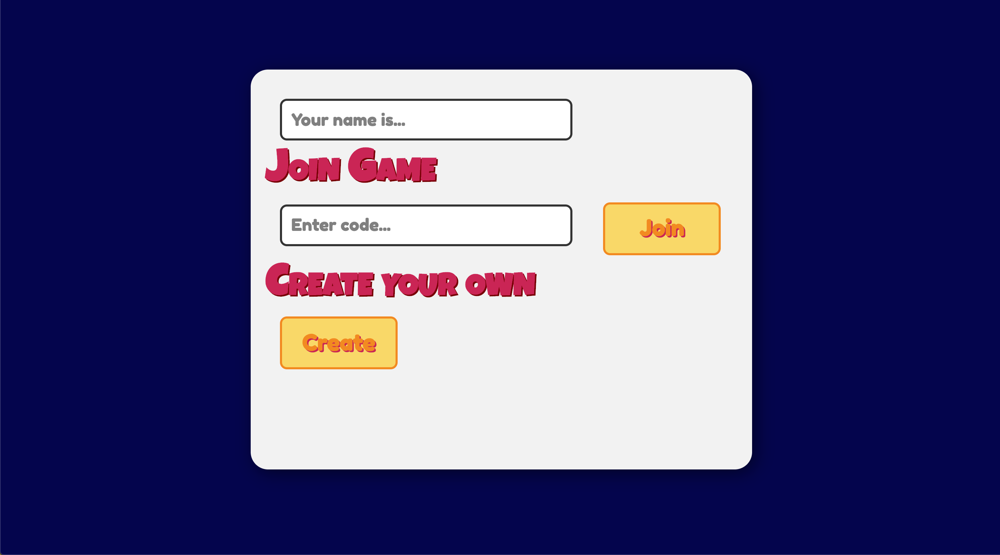
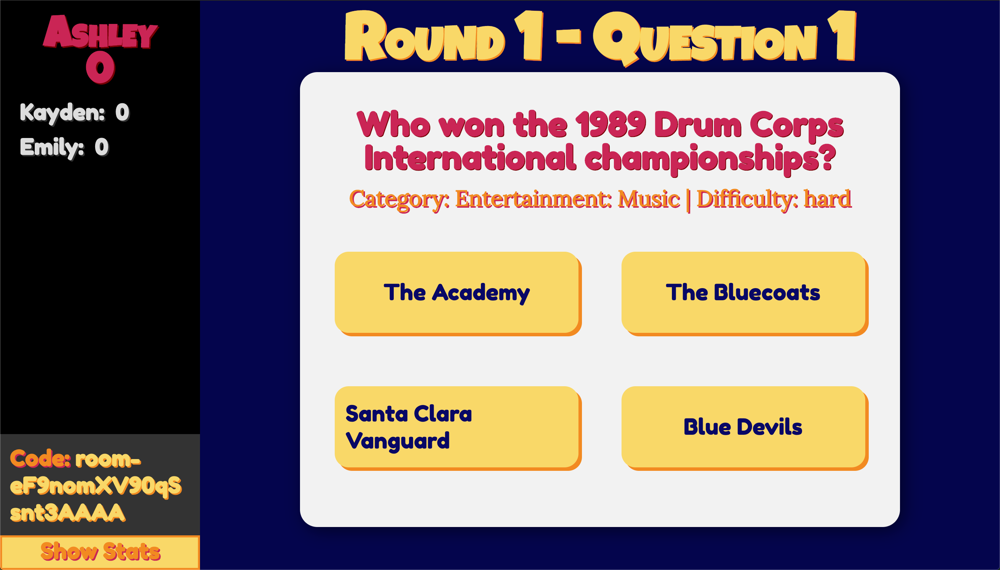

# Multiplayer-Trivia

A real-time multiplayer trivia server using Socket.io. Users can choose to create their own private room or join a preexisting one. 

Questions are generated by the [Open Trivia DB](https://opentdb.com/) and served to all users in the room. Scores and questions update at the same time for all users. Users' scores across rounds are saved, and can be seen by clicking the "Show Stats" button on the game page.

